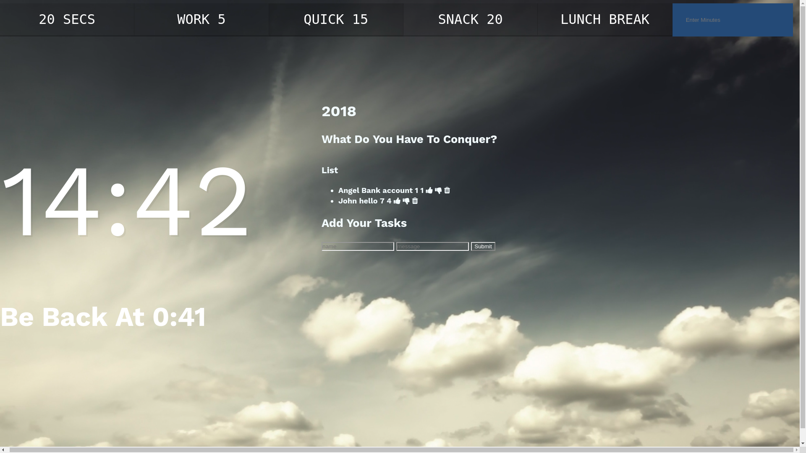

# My Awesome Project

This is a simple to-do list application that allows you to keep track of things within a list, focusing on how to use CRUD, Express, and Mongo DB, so, more server-side stuff. This being the first time I was setting up my first database and only having experience with the front end, I was really intimidating but with my previous experience in JavaScript and using Node allows you to use JavaScript as your server-side language.

*update*
I created a JavaScript & CSS Countdown Timer that has a button for 20-second break, 5-minute break, 15-minute break, 20-minute break, lunch break and as well as an input section where you can put a long time if needed. So if you wanted a 69-minute break you would just enter 69 and press enter.

## How It's Made:
HTML, CSS, Node.JS, Express, MongoDB, Javascript Framework of choice Under the Hood: First starting off with the HTML, An html.ejs file was used as a template to reduce the amount of code needed to get this app running. I put two inputs to submit the task at hand and the date due, where the list items will populate on the DOM. As well as a thumbs up if it completed or thumbs down if not complete with a delete function. Using node, express modules, MongoDB and the server localhost 3000 I was able to connect the front and back end.

I created my server.js file for my node folder and then installed Express thru the command line with Node package manager (npm), which comes bundled with Node. Once installing Node and Express, I started setting I realized that you need to restart your server whenever you make a change to the server.js file. For the styling of this website I just put a video background and white text with hover attribute for the input & button. CRUD played a major part in this so once I set up the listen method, GET request, POST request for the <form>

I was having problems because Express doesn’t handle reading data from the <form> element on its own. I had to add another package called body-parser to gain this functionality. I found out that Express allows us to add middleware like body-parser to our application with the use method. The whole MongoDB was more simple than I thought.

*update*
I had to create a function named wakanda that took the number of seconds. I created a const for the date and the seconds. I also implemented a setInterval function that used the math.round() method to round it up because it was coming up out to a decimal and made an if statement so when it reached zero it would stop but I had to store the function so that if it was less than 0 it will stop but I had problems because it wasn't running immediately and had to store the setInterval in its own variable. I made another clearInterval that passed it the name of our time which is Haiti.

I can write/talk all day but to make the summary short I made a function for the displayTimeLeft, displayEndTime(that showed when to be back), startTimer and a addEventListener for my form.

Once I got that setup, I was ready to push!

## Optimizations.
After now looking at it, I would like to add an edit button instead of a thumbs down button and I would have also change the thumbs up to a checkbox or radio buttons.

## Lessons Learned:

No matter what my experience level, being an engineer means continuously learning. Every time I build something I always have those *whoa this is awesome* or *ahh ha moment*. During this project, I learned about document.customForm and as well as e.preventDefault

## portfolio:

**WEBSITE:** https:/johnfleurimond.com

## Installation

1. Clone repo
2. run `npm install`

## Usage

1. run `npm run todo`
2. Navigate to `localhost:3000`
